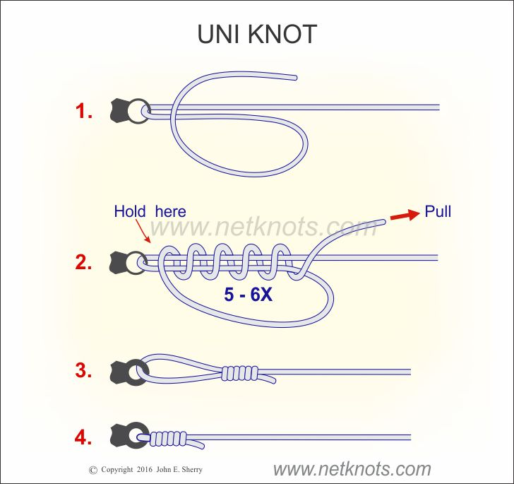

# Fishing Knots

As it turns out a lot of the skills involved in fishing have to do with preparation. One area of preparation is
knowing how to tie various knots.

The Pennsylvania Wildlife Commission has [a great guide](./img/tmf_knots.pdf) to tying knots. Most of these don't take
long to learn but you should take a hook and a line and practice tying the most basic knots, given that the simple
"double criss cross" (more formally, an overhand knot) actually weakens your line by ~50%.

Want to land bigger fish? Learn at least these two knots:

## Palomar Knot

* 95% line strength
* Takes more line to tie because it doubles a piece of line first
* Good for lines of 20+ lbs
* Some say it tangles easier because it is run doubled through

## Improved Cinch Knot

* Easy! 5 turns, then slip the end through 2 hoops and pull tight!
* Again, 95% line strength

## Uni Knot

This one is a classic and fisher favorite.

