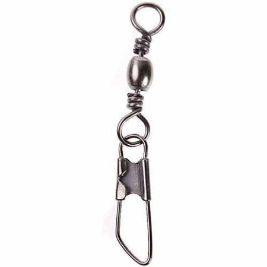
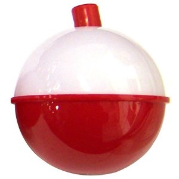

# Tackle

The goal of this article is to collect information about all the other gear
in fishing besides rods / reels / baits / lures. That is, hooks, bobbers,
sinkers, nets, fish bonkers, and swivels. Mostly this is about _terminal
tackle._

From Wikipedia: 

> Fishing tackle is the equipment used by fishermen when fishing.
> Almost any equipment or gear used for fishing can be called fishing tackle.
> Some examples are hooks, lines, sinkers, floats, rods, reels, baits, lures,
> spears, nets, gaffs, traps, waders and tackle boxes.

> Gear that is attached to the end of a fishing line is called __terminal tackle__.
> This includes hooks, leaders, swivels, sinkers, floats, split rings and wire,
> snaps, beads, spoons, blades, spinners and clevises to attach spinner blades to
> fishing lures. Sometimes the term fishing rig is used for a completed assembly
> of tackle ready for fishing.

## Swivel

A swivel is a piece of tackle that lets your bait spin freely in the water without
twisting your line. That's important because it makes your bait look more alive to
watching fish!

## Bobber

A bobber is a floater (generally a 50 cent piece of plastic) that you can clip onto your
line at some point to keep your bait at a specific depth. I think for hunting smarter fish
you probably want a more expensive bobber that doesn't look so obvious.

The red and white bobber shown here is one of the most common ones and is often used to fish
for sunfish, crappies, and bluegill.
