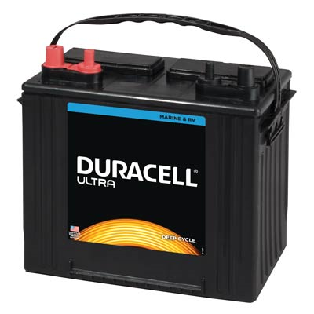

# Trolling Motors

There are two main ways to fish in a lake. The first is using a boat -- this can
be an inflatable, a row boat, a kayak or a boat with a motor. The second is
sitting at the docks in a camping chair. The first method is preferable because
you can get to where the fish are; they're pretty dumb and if you want to catch
things it's easier if you put bait right in front of them.

We noticed that someone else brought an attachable motor and was motoring their
rowboat around -- turns out this is called a *trolling motor*. I wanted one
really bad so I hit Amazon & [camelcamelcamel](http://camelcamelcamel.com) to
price compare.

The one I purchased for use on row boats and inflatables was the
[Minn Kota Endura C2 40 Freshwater Transom Mounted Trolling Motor (36" Shaft)](https://www.amazon.com/gp/product/B0043H31GG).
It came in an intimidatingly large box, but isn't actually that big and weighs
maybe 15lbs; it's very transportable and easy to set up. I stuck the telescoping
handle into the body to set it up (...didn't quite read instructions until doing
that and realizing it's a one-time permanent operation), but there wasn't much
else I needed the instructions for. It clamps on to the back of a row boat or
other lake vessel (works with some ~$150-200 inflatable boats like
[this](https://www.amazon.com/Sevylor-Fish-Hunter-Inflatable-4-Person/dp/B0032GM1QA);
brand names Sevylor and Intex are both pretty common).

## TL;DR

TL;DR you'll probably spend $160 (trolling motor) + $50 (fancy battery charger) +
$100 (deep cycle marine battery) + $50 (optional-ish battery case / circuit
breaker) = $360 if you want to get into the trolling motor game.  If you're not
ready to drop that kind of dough, maybe stick to fishing on a pier or dock for a
while, though personally I think $360 for a bunch of equipment that you'll use
for a really long time is actually pretty affordable, amortized cost and
all! The only thing that you'll ever have to replace is the battery and
it's good for a really long time. You can also try to get components
that were cheaper than the ones I got though I'm really happy with my
purchases and think if you have a little cash to spare it's probably
worth it.

## Why Use a Trolling Motor

Clanging around in a rowboat is suboptimal:

* Clanging scares fish.
* The current set us adrift and it was hard to maintain good position.
* Getting back to shore was really exhausting. Fishing is tiring
  as it is.

## Deep Cycle Marine Batteries

Trolling motors are generally battery powered. Shannon and I spent ~6 hours out
on the lake and used less than 1/4 of our group 24 battery. What I learned about
batteries is as follows:

* Batteries are rated in "groups" -- for marine trolling batteries you're
  probably looking for a group 24 or group 27 battery. These numbers define the
  physical dimensions of the battery case and is important because some
  applications may require specific case sizes. The BCI does not determine the
  Amp Hours (AH) rating for the batteries, but there is a correlation between
  case size and AH rating. For deep cycle batteries, the larger the case size
  the more capacity the battery will usually have.
* Batteries are heavy. Mine is a Duracell Group 24M 75AH Marine Deep Cycle
  battery, and it weighs close to 50lbs.
* Wet cell batteries like these need to be constantly plugged in if you want
  them to be maintained / not go bad. That means either leaving it plugged in,
  in a garage, or if you live in a studio like I do...I charge it under your
  desk? It's huge. I kinda wish I could leave it somewhere I wasn't breathing
  the same air as it or risking an explosion -- I might move it to a friend's
  garage at some point. I bought a fancy [Minn Kota Battery Charger and
  Maintainer](https://www.amazon.com/gp/product/B000MN8SEK) that has advanced
  features like __not blowing up when you attach the cables the wrong way.__
  Derp.
* You probably want to know how much power you have left as you're motoring
  through some massive lake. Thankfully I purchased a [Minn Kota Battery Power
  Center](https://www.amazon.com/gp/product/B001PTHKMG) which has that, and a
  circut breaker specifically perfect for trolling motors. Knowing approximately
  nothing about boats or fishing I decided to get slightly nice stuff from what
  seems to be a brand name that has good reviews on Amazon.
* "Deep Cycle" refers to the fact that these batteries can withstand getting
  depleted and recharged (deep cycled) many times.
* "Deep Cycle _Marine_" just means the battery has what they call "cold cranking
  amps" -- this is needed because more power is needed to first start your
  motor, then some electricity to sustain. Car and motorcycle engine batteries
  give starting power but then your car runs on gas, so they don't need to give
  sustained power...thus they're not a good option / won't work for trolling
  motors. I was sad to hear this because aluminum 12v batteries are SUPER LIGHT
  weight-wise. Battery guy said I'd have to wait another 20 years or so before I
  could get something like that for my trolling motor.
* Amazon doesn't have great options for deep cycle marine batteries. I bought
  mine at a local store called "Batteries + Bulbs" (that's all they sell)!

My group 24 battery is approximately the size of a car battery:

